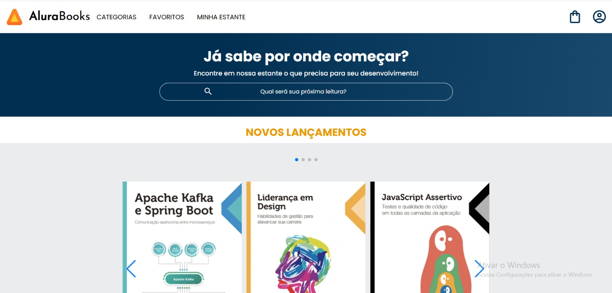
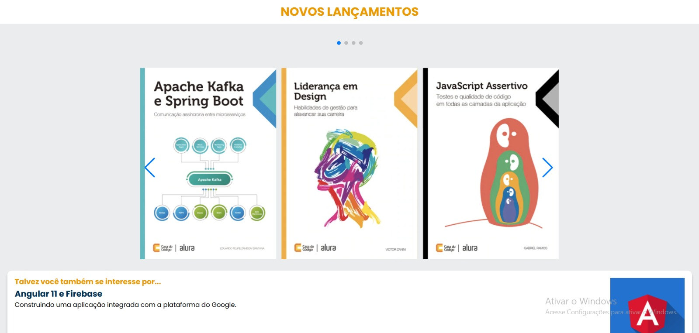

# 📚 Alura Books - Projeto de Página Responsiva

🖥️ Projeto desenvolvido como parte dos cursos da **Alura**, com o objetivo de criar uma **página inicial de uma livraria online** utilizando apenas HTML e CSS.

<div></div> <br>

<div></div>

## 📌 Sobre o Projeto | About the Project

Este projeto simula uma livraria digital chamada **Alura Books**. A ideia principal era construir uma **landing page moderna, acessível e responsiva** baseada em um layout fornecido pela Alura.

---

This project simulates a digital bookstore called **Alura Books**. The main goal was to build a **modern, accessible, and responsive landing page** based on a layout provided by Alura.

## 🛠️ Tecnologias | Technologies

- HTML5  
- CSS3 (com Flexbox e Grid)  
- Git & GitHub

## 🎯 Funcionalidades | Features

- Layout responsivo para diferentes tamanhos de tela  
- Menus de navegação e carrosséis visuais  
- Seções organizadas por categorias e promoções

---

- Responsive layout for multiple screen sizes  
- Navigation menus and visual carousels  
- Sections organized by categories and promotions

## 🔗 Link do Projeto | Project Link

👉 [Acesse o site](https://leticiamaca.github.io/Alura-Books)

## 🚀 Como Rodar Localmente | How to Run Locally

```bash
# Clone o repositório
git clone https://github.com/leticiamaca/Alura-Books

# Acesse a pasta do projeto
cd Alura-Books

# Abra o arquivo index.html no navegador
````

### 📚 Aprendizados | What I Learned
Estruturação de páginas com HTML semântico
---
- Layouts responsivos com Flexbox e Grid

- Organização de conteúdo visual e navegação

- Boas práticas de CSS moderno

- Structuring pages using semantic HTML

- Responsive layouts using Flexbox and Grid

- Organizing visual content and navigation

- Clean and modern CSS practices
---
### 👩‍💻 Desenvolvido por | Developed by
Letícia de Castro Jacob Marques
GitHub Profile
